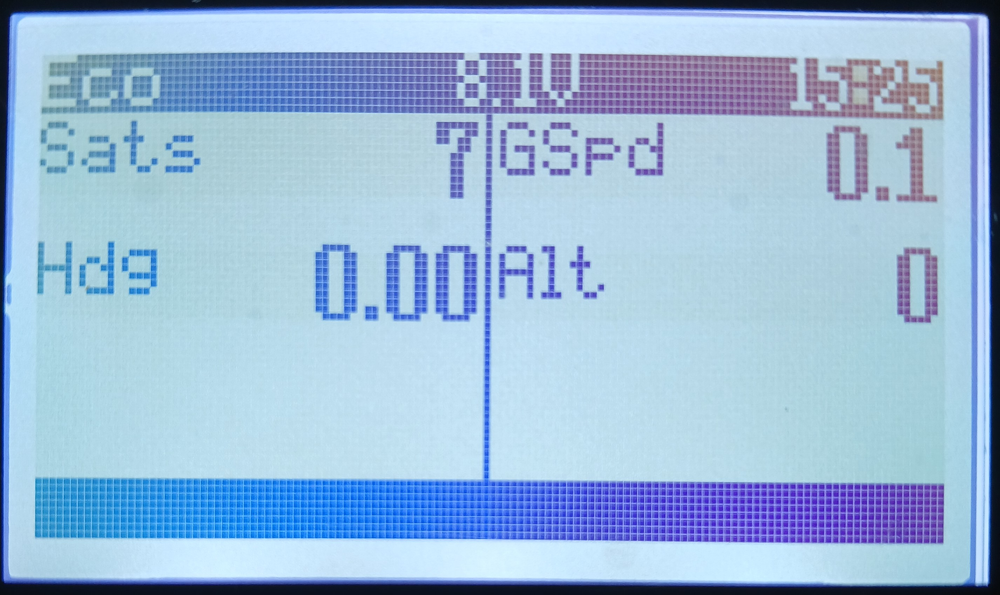

# CRSF GPS Speed and Coordinates Sensor

This sensor based on a [SeeedStudio XIAO SAMD21](https://www.seeedstudio.com/Seeeduino-XIAO-Arduino-Microcontroller-SAMD21-Cortex-M0+-p-4426.html) reads from a GPS module and sends GPS telemetry values using the CRSF protocol, which can be consumed by an appropriate [ELRS](https://www.expresslrs.org/) radio control receiver, for example a RadioMaster ER4, ER6 or ER8.

The GPS module can be disabled using a switch on the transmitter to save power when its not needed.

Current meassurements show this sensor takes 80-90mA with the *TOPGNSS GG-1802* GPS module used.

## GPS Module Configuration

The following configuration is optimised for a yacht, you may need to alter the  *Dynamic Model* for a plane. 

The *TinyGPSPlus* library parses only the *$GPGGA* and *$GPRMC* NMEA sentences, so all others are turn off to reduce the serial load on the SAMD21 at the 3Hz GPS update rate configured.

Configure the following in the *View->Configuration View* of the [u-blox u-center](https://www.u-blox.com/en/product/u-center) application:
* PRT->Baudrate: 57600
* RATE->Measurement Period: 333ms
* PMS->Setup ID: 0 - Full Power
* NAV5->Dynamic Model: 3 - Portable
* GNSS: GPS and SBAS only enabled
* MSG->Message->F0-01 NMEA GxGLL: uncheck all
* MSG->Message->F0-02 NMEA GxGSA: uncheck all
* MSG->Message->F0-03 NMEA GxGSV: uncheck all
* MSG->Message->F0-05 NMEA GxVTG: uncheck all

## LEDs

* Red - flashes once every two seconds after CRSF protocol is started.
* Blue - flashes once for every NMEA message received from the GPS.
* Green - flashes once per telemetry message over CRSF, once a GPS fix is obtained.

## Connections

* SAMD21 GND -> GNSS GND
* SAMD21 5V -> GNSS VCC
* SAMD21 D9 -> GNSS TX
* SAMD21 D10 -> GNSS RX
* SAMD21 5V -> Recv +
* SAMD21 GND -> Recv -
* SAMD21 TX -> Recv CRSF RX
* SAMD21 RX -> Recv port TX

## Telemetry Sensors

* GPS
* GSpd
* Hdg
* Alt
* Sats

## Libraries

* [TinyGPSPlus](https://github.com/mikalhart/TinyGPSPlus)
* [CRSF for Arduino](https://github.com/ZZ-Cat/CRSFforArduino)
* [ezLED](https://github.com/zetavg/arduino-ezLED)
* [Printf](https://github.com/embeddedartistry/arduino-printf/tree/master)
* [Kalman Filter](https://github.com/denyssene/SimpleKalmanFilter)

## References

* [How To Optimize GPS Receiver Settings in U-Center To Get More Satellite Locks](https://oscarliang.com/gps-settings-u-center/)